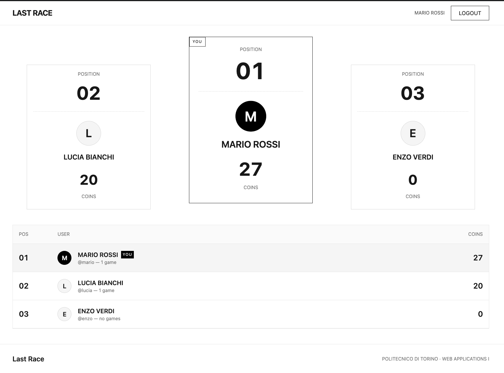
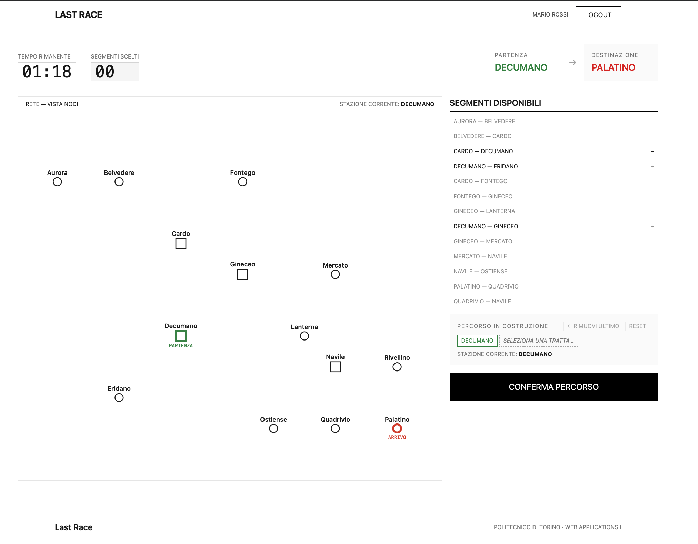

# Exam #1: "Last Race"
## Student: s359954 Pasquale Livrieri

> Single-player SPA set on a fictional metro network. The player receives a
> start and a destination, plans a valid route within 90 seconds, then
> executes it: each segment traversed triggers a random event (−4 to +4
> coins) and the final score is the coin balance at the end of the run.

## Getting Started

Requires **Node 24 LTS**, **npm**, and **nodemon** (assumed globally
installed). **"Two servers"** pattern: client on `:5173`, server on `:3001`,
session via HTTP-only cookie with `credentials`.

```sh
# 1) Backend
cd server
npm install
npm run seed       # first run only — populates SQLite
nodemon index.js   # node on http://localhost:3001

# 2) Frontend (separate shell)
cd client
npm install
npm run dev        # Vite on http://localhost:5173
```

## React Client Application Routes

- Route `/` — **Instructions** page. Accessible to anonymous users. Shows the
  4 game phases and key rules; CTA to `/login` for anonymous, "Start game" +
  "Ranking" for logged-in users.
- Route `/login` — **Login** form. Ticket-styled card with `username` /
  `password` fields, client-side validation (required fields) and server-side
  validation (Passport local + `crypto.scrypt`).
- Route `/play` — protected. State machine `setup → planning → execution →
  result` on the same page with no browser reload:
  - **Setup**: full map (4 coloured lines, 14 stations, 4 interchanges),
    colour legend, and "Start game" button that creates the game server-side.
  - **Planning**: 90 s timer (tabular digits), "nodes-only" map view without
    lines, list of the 14 real selectable segments (each usable once and only
    from the current station), "Route in progress" chip with "Remove last" and
    "Reset", "Confirm route" button. On timer expiry the current route is
    submitted automatically; if incomplete the game closes with score 0.
  - **Execution**: step-by-step reveal with "Next stop" (last segment →
    "See result"), persistent coin counter with per-segment delta, progress
    rail tracker from start to destination, dedicated card for an invalid
    route.
  - **Result**: final screen with final score, "New record" badge if the score
    beats the previous best, invalid-reason summary if applicable, CTAs "New
    game" + "See ranking".
- Route `/ranking` — protected. Top-3 podium + POS/USER/COINS table with
  the current user's row highlighted and a "YOU" badge. Circular avatar with
  the username initial.

## API Server

All routes are under `/api` and return JSON. Protected routes require a valid
Passport session; without one they respond `401 { error }`.

### Health
- **GET `/api/health`** — public.
  - **Response 200**: `{ "status": "ok", "authenticated": <boolean> }`.
  - Also used by the client for session bootstrap (avoids console 401 when
    anonymous).

### Sessions
- **POST `/api/sessions`** — login.
  - **Body**: `{ "username": <string>, "password": <string> }` (both required
    and non-empty, validated on Express and React sides).
  - **Response 200**: `{ "id": <number>, "username": <string>, "displayName": <string> }`.
  - **400**: `{ "error": "Username is required." | "Password is required." }`.
  - **401**: `{ "error": "Invalid credentials." }`.
- **GET `/api/sessions/current`** — logged-in user. *Protected.*
  - **Response 200**: `{ "id", "username", "displayName" }`.
  - **401**: `{ "error": "Not authenticated." }`.
- **DELETE `/api/sessions/current`** — logout. *Protected.*
  - **Response 204** (empty) + `lastrace.sid` cookie invalidated.

### Network (map)
- **GET `/api/network`** — *protected.*
  - **Response 200**:
    ```json
    {
      "lines":    [ { "id", "name", "color" } ],
      "stations": [ { "id", "name", "interchange": <boolean>, "x", "y" } ],
      "segments": [ { "id", "lineId", "a": <stationId>, "b": <stationId> } ]
    }
    ```

### Games
- **POST `/api/games`** — new game. *Protected.*
  - **Body**: none.
  - **Response 200**:
    ```json
    {
      "gameId": <number>,
      "start":       { "id", "name" },
      "destination": { "id", "name" },
      "segments": [ { "a": <stationName>, "b": <stationName> } ]
    }
    ```
    The server picks start/destination with a minimum distance of 3 segments.
    Segments return only pairs of names: the line they belong to is not
    exposed during Planning.
- **POST `/api/games/:id/route`** — submit route. *Protected.*
  - **URL params**: `id` (positive integer, validated).
  - **Body**: `{ "route": [<stationName>, ...] }` (array of strings).
  - **Validation**: server checks route starts at `start`, ends at
    `destination`, uses only existing segments without reuse, and changes line
    only at stations with `is_interchange = 1`.
  - **If valid**: extracts a random event per segment, accumulates from 20
    coins, persists `games(final_score, valid=1)` + `game_steps[]` in a
    transaction and responds:
    ```json
    {
      "gameId", "valid": true, "reason": null,
      "steps": [ { "from", "to", "event", "effect", "total" } ],
      "finalScore": <max(0, total)>
    }
    ```
  - **If invalid**: persists `final_score=0, valid=0` and responds
    `{ valid: false, reason: <string>, steps: [], finalScore: 0 }`.
  - **400** malformed payload · **403** game not owned by user · **404** game
    not found · **409** game already completed.

### Ranking
- **GET `/api/ranking`** — *protected.*
  - **Response 200**: array of `{ rank, userId, username, displayName, best, gamesPlayed, isMe }`
    ordered by `best DESC, username ASC`. For each user `best` =
    `MAX(final_score)` on valid-only games (0 if none).

## Database Tables

SQLite file: `server/db/last_race.sqlite`. Schema: `server/db/schema.sql`.

- **`users`** — registered users. Columns: `id`, `username` (UNIQUE),
  `display_name`, `salt`, `password_hash`. Passwords salted and hashed with
  `crypto.scrypt` (hex-encoded 32-byte hash).
- **`lines`** — 4 metro lines (Red, Blue, Green, Yellow). Columns: `id`,
  `name` (UNIQUE), `color` (hex).
- **`stations`** — 14 stations with canonical coordinates `viewBox 0 0 900 780`.
  Columns: `id`, `name` (UNIQUE), `is_interchange` (0/1), `x`, `y`.
- **`events`** — 8 events with effect in `[-4, +4]`. Columns: `id`, `name`
  (UNIQUE), `effect` (CHECK `BETWEEN -4 AND 4`).
- **`segments`** — 14 edges (station adjacencies). Columns: `id`, `line_id`,
  `station_a`, `station_b`, UNIQUE on `(line_id, station_a, station_b)`.
- **`games`** — played games. Columns: `id`, `user_id`, `start_id`,
  `dest_id`, `final_score` (`NULL` until completed), `valid` (0/1/NULL),
  `created_at`. Negative balances are stored as 0.
- **`game_steps`** — events applied segment by segment. Composite key
  `(game_id, idx)`. Columns: `from_id`, `to_id`, `event_id`, `effect`,
  `total` (cumulative coins after the step).

## Main React Components

- **`App`** (`App.jsx`) — `BrowserRouter` + `AuthProvider`. `ChromeShell`
  wrapper that hides Header/Footer on the `/login` route. Protected routes
  via `ProtectedRoute`.
- **`AuthProvider`** (`contexts/AuthContext.jsx`) — context with `user`,
  `loading`, `login`, `logout`. Session bootstrap via `GET /api/health` to
  avoid console 401 when anonymous. `useAuth` hook exported from
  `contexts/useAuth.js` (separate file for the react-refresh linter).
- **`ProtectedRoute`** (`components/ProtectedRoute.jsx`) — redirects to
  `/login` preserving the original URL in `location.state.from`.
- **`Header` / `Footer`** (`components/`) — global chrome. Header shows
  "Login" for anonymous, `displayName` + "Logout" for logged-in users.
- **`NetworkMap`** (`components/NetworkMap.jsx`) — data-driven reusable SVG
  component. Prop `variant: 'full' | 'nodes'`: in Setup draws coloured
  polylines and nodes; in Planning draws nodes only at the same canonical
  coordinates. Highlights start (green) and destination (red) with
  "START" / "END" labels.
- **`NetworkLegend`** (`components/NetworkLegend.jsx`) — line colour legend +
  interchange symbol.
- **`AvatarInitial`** (`components/AvatarInitial.jsx`) — circle with the
  username initial (no photo), `accent` variant for highlight.
- **`PhaseList`** (`components/PhaseList.jsx`) — renders the 4 game-phase
  cards on the Home page.
- **`PodiumCard`** (`components/PodiumCard.jsx`) — single podium card (1st,
  2nd, 3rd place) used by the ranking page.
- **`RankingRow`** (`components/RankingRow.jsx`) — single user row in the
  ranking table, highlights the current user.
- **`CoinCounter`** (`components/CoinCounter.jsx`) — top bar in Execution:
  current coins, starting coins, current step effect delta.
- **`SegmentCard`** (`components/SegmentCard.jsx`) — current-segment card
  in Execution: from→to + event name + coin effect.
- **`ProgressRail`** (`components/ProgressRail.jsx`) — Execution progress
  bar with per-step dots from start to destination.
- **`HomePage`** (`pages/HomePage.jsx`) — Instructions: 4 game phases, key
  rules, context-aware CTA (anonymous vs logged-in).
- **`LoginPage`** (`pages/LoginPage.jsx`) — login form with field validation,
  credential error handling, show/hide password toggle.
- **`GamePage`** (`pages/GamePage.jsx`) — state machine `setup → planning →
  execution → result`. Loads `/api/network` once and, before entering
  execution, fetches the previous best score to show the "New record" badge
  on the result screen.
- **`PlanningView`** (`pages/PlanningView.jsx`) — full Planning phase
  (timer + node map + segment list + route in progress + auto-submit on
  timer expiry).
- **`ExecutionView`** (`pages/ExecutionView.jsx`) — step-by-step event
  reveal, persistent coin counter, rail tracker, dedicated card for invalid
  route.
- **`RankingPage`** (`pages/RankingPage.jsx`) — top-3 podium + full table,
  current user row with "YOU" badge and accent avatar.
- **`useCountdown`** (`hooks/useCountdown.js`) — countdown hook used in
  Planning: per-second decrement, `onExpire` callback on expiry.
- **`utils/effect.js`** — shared helpers `effectLabel` and `effectColor`
  used by `CoinCounter` and `SegmentCard`.
- **`api/API.js`** — `fetch` wrapper with `credentials: 'include'` and
  JSON/text error handling.

## Users Credentials

Defined in `server/db/seed.js` (idempotent). Three registered users, two with
a seed game already played to populate the ranking.

| username | password  | notes                                |
|----------|-----------|--------------------------------------|
| `mario`  | mario123  | seed game with score 27              |
| `lucia`  | lucia123  | seed game with score 20              |
| `enzo`   | enzo123   | no games played                      |

## Screenshots

### Ranking page



### During a game — Execution phase



## Use of AI Tools

AI tools were used in the following areas:

- **Database seed data**: station names, event descriptions, and demo user records were generated with Claude Code.
- **UI design**: screens were designed with **Google Stitch** (AI-powered design tool), which produced a Tailwind-based component structure — this justified adopting Tailwind CSS for the frontend.
- **Debugging**: AI assisted in diagnosing runtime issues during development.
- **curl test scripts**: API smoke-tests in the `tests/` directory were generated with Claude Code.
- **README**: this file was generated with Claude Code.
